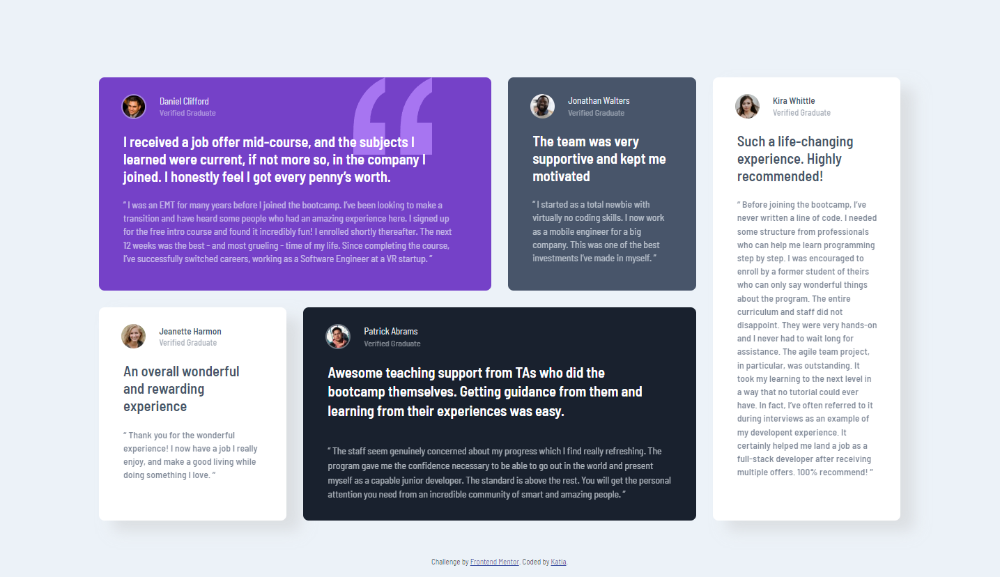
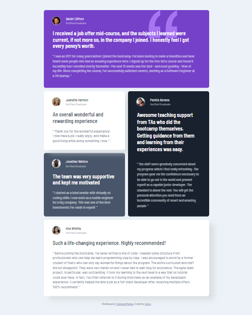

# Frontend Mentor - Testimonials grid section solution

This is a solution to the [Testimonials grid section challenge on Frontend Mentor](https://www.frontendmentor.io/challenges/testimonials-grid-section-Nnw6J7Un7). Frontend Mentor challenges help you improve your coding skills by building realistic projects. 

## Table of contents

  - [The challenge](#the-challenge)
  - [Screenshot](#screenshot)
- [My process](#my-process)
  - [Built with](#built-with)
  
## Overview

Users should be able to:

- View the optimal layout for the site depending on their device's screen size

### Screenshot

## My process

Since I got more familiarized with the use of grid I could finish this project without many trouble, I still faced some issues with the position of the elements spececially the "attribution" one.
I felt great about this challenge because I came with solutions of any problem faster than before.

### Built with

- Semantic HTML5 markup
- CSS custom properties
- Flexbox
- CSS Grid
